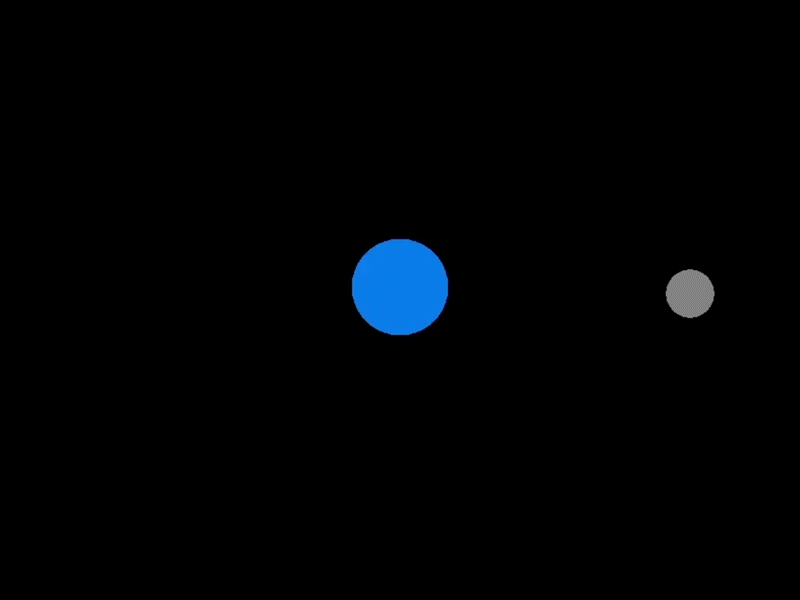

# Impulse

**Orbital Dynamics And Mission Control Simulator**

### ----🚧🚧🚧🚧 UNDER CONTRUCTION 🚜👷🏗️🚧🚧🚧🚧----

A from-scratch, scriptable orbital mechanics simulator built in C++ with Raylib. Designed for mission planning, trajectory visualization, and delta-v budgeting.

---

## Milestones

### ✅ Working N Body rk4
First major milestone. Implemented 4th order Runge-Kutta integrator from first principles. No tutorials. No copy-paste. Just the formula and understanding.

*"The circles obey gravity now."*

 
*Moon orbiting Earth at a ridiculously close distance*

---

## Status

**Phase 1: Core Engine** — in progress 
**Phase 1.5: Spacecraft physics and controls - planned
**Phase 2: CLI & Scripting** — planned
**Phase 3: Mission Planning** — Planned

---

